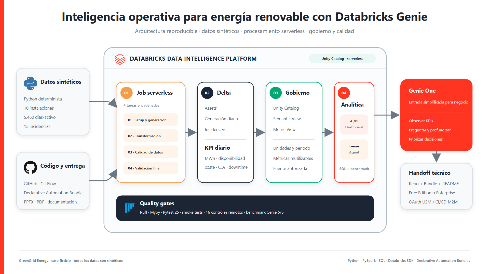
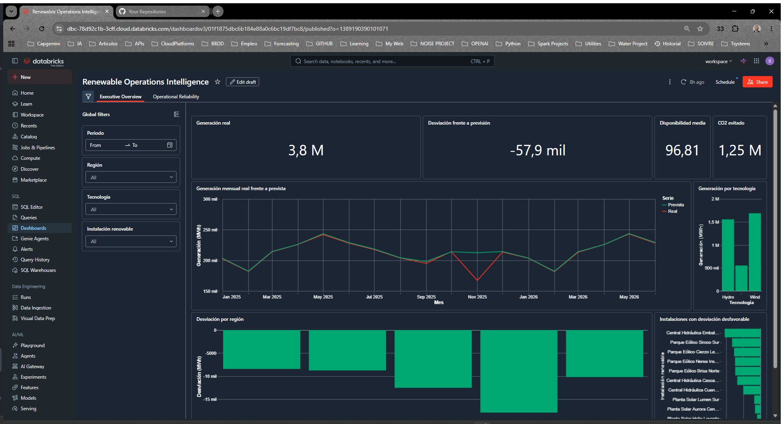
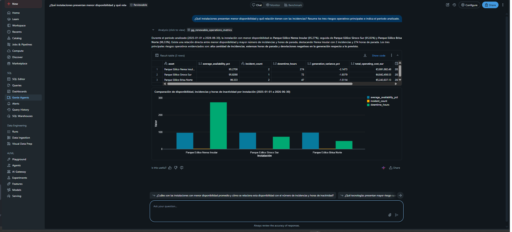

# Inteligencia operativa para energía renovable con Databricks Genie

<p align="center">
  
</p>

<p align="center">
  <a href="https://github.com/Rafavermar/Databricks-Genie-Demo/actions/workflows/quality.yml">
    
  </a>
  
  
</p>

Prueba de viabilidad e implementación reproducible para la compañía energética
ficticia **GreenGrid Energy**. El proyecto integra datos operativos sintéticos,
procesamiento serverless, métricas gobernadas, un AI/BI Dashboard, un Genie
Agent y acceso desde Genie One.

> Todos los nombres, instalaciones, responsables, incidencias y valores son
> sintéticos. No representan ni permiten inferir información de ninguna empresa
> o instalación real.

## Qué demuestra

- Un recorrido de negocio coherente: observar KPIs, diagnosticar desviaciones y
  profundizar con lenguaje natural.
- Un flujo técnico reproducible: job serverless, Delta, capa semántica,
  dashboard y Genie Agent.
- Confianza verificable: SQL visible, quality gates, smoke tests, idempotencia y
  cinco benchmarks de Genie.
- Dos rutas de adopción: exploración individual en Free Edition y despliegue
  gobernado en Enterprise.

No es un sistema productivo ni está conectado a una compañía real. Es una base
de demostración diseñada para que negocio entienda el potencial y para que un
desarrollador pueda reproducirlo sin depender del workspace original.

## Vista rápida de la experiencia

<table>
  <tr>
    <td width="50%">
      
    </td>
    <td width="50%">
      
    </td>
  </tr>
  <tr>
    <td><strong>Observar:</strong> KPIs, previsión, disponibilidad y riesgos.</td>
    <td><strong>Profundizar:</strong> preguntas, SQL visible y evidencia.</td>
  </tr>
</table>

**Entregables:** [PowerPoint editable](presentation/renewable_operations_demo.pptx)
· [PDF](presentation/renewable_operations_demo.pdf)
· [guía de publicación](docs/publication.md)

## Qué contiene el repositorio

| Componente | Responsabilidad | Implementación |
|---|---|---|
| Declarative Automation Bundle | Desplegar el job y el dashboard | `databricks.yml`, `resources/*.yml` |
| Job serverless | Ejecutar el flujo idempotente de cuatro tareas | `notebooks/01_*.py` a `04_*.py` |
| Datos y semántica | Delta, KPI diario, Semantic View y Metric View | Python, PySpark y Spark SQL |
| AI/BI Dashboard | KPIs ejecutivos y fiabilidad operativa | `dashboard/*.lvdash.json` |
| Genie Agent | Instrucciones, SQL de referencia y benchmarks | `scripts/create_or_update_genie.py` |
| Calidad | Lint, tipos, unit tests, smoke tests y benchmark | Ruff, Mypy, Pytest y Databricks SDK |
| Automatización | Calidad continua y despliegue Enterprise manual | `.github/workflows/` |
| Entregable | Presentación y PDF para negocio | `presentation/` |

El bundle despliega el **job y el dashboard**. Después de ejecutar el job, el
script `create_or_update_genie.py` configura o actualiza el Genie Agent sobre
la Metric View; si no está disponible, puede usar la Semantic View.

## Flujo del job

| Orden | Notebook | Resultado |
|---:|---|---|
| 1 | `01_setup_and_generate_data.py` | Schema aislado y tres tablas Delta sintéticas |
| 2 | `02_transform_and_publish.py` | KPI diario, Semantic View y Metric View |
| 3 | `03_data_quality_checks.py` | Conteos, claves, rangos y contrato de calidad |
| 4 | `04_demo_validation.py` | Evidencia final y estado del despliegue |

La ejecución predeterminada cubre del 1 de enero de 2025 al 30 de junio de
2026: 10 instalaciones, 5.460 observaciones diarias y 15 incidencias.

## Elegir el entorno de destino

| Aspecto | Free Edition | Enterprise |
|---|---|---|
| Target del bundle | `dev` | `enterprise` |
| Modo | `development` | `production` |
| Compute | Solo serverless | Serverless recomendado |
| Catálogo | `workspace` | Catálogo corporativo autorizado |
| Warehouse | SQL warehouse existente | SQL warehouse existente con `CAN USE` |
| Autenticación local | OAuth U2M | OAuth U2M |
| Automatización | Uso interactivo | OAuth M2M con service principal |
| Objetivo | Prueba individual | Workspace gobernado y CI/CD |

El proyecto no crea infraestructura de cuenta, redes, almacenamiento externo ni
un SQL warehouse. Esos recursos deben existir en el workspace de destino.

## Prerrequisitos comunes

- Git.
- Python 3.11 o 3.12.
- `uv`.
- Databricks CLI v0.218.0 o posterior; se recomienda la versión actual.
- Workspace con Unity Catalog y workspace files habilitados.
- SQL warehouse serverless existente y su ID; el repositorio no contiene un
  valor predeterminado ligado al workspace del autor.
- Permiso para crear el schema y los recursos del bundle.

Preparación local:

```powershell
git clone https://github.com/Rafavermar/Databricks-Genie-Demo.git
cd Databricks-Genie-Demo
uv sync
```

## Reproducción en Databricks Free Edition

Free Edition dispone únicamente de compute serverless y está sujeta a límites
de fair-use. Utilice el target `dev`.

### 1. Autenticarse y seleccionar recursos

```powershell
$profile = "<perfil-free>"
$hostUrl = "https://<workspace-host>"
$warehouseId = "<sql-warehouse-id>"

databricks auth login --host $hostUrl --profile $profile
databricks auth profiles

$env:DATABRICKS_CONFIG_PROFILE = $profile
$env:BUNDLE_VAR_catalog = "workspace"
$env:BUNDLE_VAR_schema = "renewable_operations_demo"
$env:BUNDLE_VAR_warehouse_id = $warehouseId

uv run python scripts/detect_free_edition.py --profile $profile
```

No guarde tokens, cookies ni secretos en el repositorio.

### 2. Validar, desplegar y ejecutar

```powershell
databricks bundle validate -t dev --profile $profile
databricks bundle deploy -t dev --profile $profile
databricks bundle run -t dev renewable_operations_setup --profile $profile
```

### 3. Configurar Genie y comprobar el resultado

```powershell
uv run python scripts/create_or_update_genie.py `
  --profile $profile `
  --warehouse-id $warehouseId `
  --catalog workspace `
  --schema renewable_operations_demo

uv run python scripts/smoke_test.py `
  --profile $profile `
  --warehouse-id $warehouseId `
  --catalog workspace `
  --schema renewable_operations_demo
```

Si la Metric View no está disponible:

```powershell
uv run python scripts/create_or_update_genie.py `
  --profile $profile `
  --warehouse-id $warehouseId `
  --catalog workspace `
  --schema renewable_operations_demo `
  --use-semantic-view
```

## Reproducción en Databricks Enterprise

Utilice un catálogo y un schema aislados para la prueba. La identidad que
despliega necesita, como mínimo:

- `USE CATALOG` sobre el catálogo;
- `CREATE SCHEMA`, o acceso a un schema previamente aprovisionado;
- permisos para crear tablas y vistas dentro del schema;
- `CAN USE` sobre el SQL warehouse;
- acceso de escritura a su carpeta de usuario o service principal bajo
  `/Workspace/Users`;
- permisos para crear y administrar los jobs y dashboards del bundle.

### 1. Autenticación local U2M

```powershell
$profile = "<perfil-enterprise>"
$hostUrl = "https://<workspace-enterprise>"
$catalog = "<catalog-autorizado>"
$schema = "renewable_operations_demo"
$warehouseId = "<sql-warehouse-id>"

databricks auth login --host $hostUrl --profile $profile

$env:DATABRICKS_CONFIG_PROFILE = $profile
$env:BUNDLE_VAR_catalog = $catalog
$env:BUNDLE_VAR_schema = $schema
$env:BUNDLE_VAR_warehouse_id = $warehouseId
```

### 2. Desplegar con el target de producción

```powershell
databricks bundle validate -t enterprise --profile $profile
databricks bundle deploy -t enterprise --profile $profile
databricks bundle run -t enterprise renewable_operations_setup --profile $profile
```

### 3. Configurar Genie y ejecutar smoke tests

```powershell
uv run python scripts/create_or_update_genie.py `
  --profile $profile `
  --warehouse-id $warehouseId `
  --catalog $catalog `
  --schema $schema

uv run python scripts/smoke_test.py `
  --profile $profile `
  --warehouse-id $warehouseId `
  --catalog $catalog `
  --schema $schema
```

Para CI/CD use OAuth M2M y almacene `DATABRICKS_CLIENT_SECRET` en el gestor de
secretos del sistema de automatización. No incluya credenciales en YAML,
scripts, logs ni variables versionadas. Revise también quién puede desplegar,
ejecutar y administrar los recursos del target `enterprise`.

## Automatización con GitHub Actions

`quality.yml` se ejecuta en pull requests y pushes hacia `develop` o `main`.
Comprueba dependencias bloqueadas, Ruff, formato, Mypy, Pytest y generación de
la presentación.

`databricks-deploy.yml` es deliberadamente **manual** y utiliza el GitHub
Environment `databricks-demo`. Antes de ejecutarlo configure:

| Tipo | Nombre |
|---|---|
| Variable | `DATABRICKS_HOST` |
| Variable | `DATABRICKS_CLIENT_ID` |
| Variable | `DATABRICKS_CATALOG` |
| Variable | `DATABRICKS_SCHEMA` |
| Variable | `DATABRICKS_WAREHOUSE_ID` |
| Secret | `DATABRICKS_CLIENT_SECRET` |

El workflow valida y despliega el target `enterprise`, ejecuta el job y,
opcionalmente, configura Genie y lanza los smoke tests. El environment puede
protegerse con aprobación manual y restringirse a `main`. Los scripts de Genie
y smoke tests aceptan `--profile` para uso local o autenticación unificada para
CI/CD.

## Validación local

```powershell
uv run ruff check .
uv run ruff format --check .
uv run mypy src
uv run pytest -q --cov
databricks bundle schema
```

Estado verificado del repositorio:

- 25 tests superados y 1 integración omitida por defecto;
- 91,01 % de cobertura;
- 16 controles de calidad remotos;
- dos ejecuciones idempotentes del job;
- benchmark real del Genie Agent: 5/5.

La integración remota es opt-in:

```powershell
$env:RUN_DATABRICKS_INTEGRATION = "1"
uv run pytest tests/integration -q
```

## Abrir los recursos desplegados

```powershell
databricks bundle summary -t dev --profile $profile
databricks bundle open -t dev renewable_operations_dashboard --profile $profile
```

En Enterprise sustituya `dev` por `enterprise`.

## Presentación

```powershell
uv run python presentation/generate_presentation.py
.\scripts\export_presentation.ps1
```

El entregable contiene:

- narrativa para negocio;
- capturas del dashboard, Genie Agent y benchmark;
- modelo de compartición por audiencia;
- anexos de implementación y reproducción;
- última diapositiva de guía interna, eliminable antes de enviar al cliente.

La portada pública en PNG, las recomendaciones para LinkedIn/Medium y las
afirmaciones seguras para comunicación externa se describen en
[`docs/publication.md`](docs/publication.md).

## Cómo compartir el proyecto

| Destinatario | Entrega recomendada |
|---|---|
| Usuario de negocio | Dashboard y Genie Agent publicados, consumidos desde Genie One |
| Equipo técnico | Repositorio GitHub y documentación |
| Otro workspace | Repositorio + target del Declarative Automation Bundle |
| Usuario externo | PPTX/PDF, vídeo o integración autenticada |

El bundle es el mecanismo de despliegue; no es el artefacto que consume el
usuario de negocio.

## Alcance deliberado

El demo implementa la experiencia analítica completa, pero no pretende simular
una plataforma productiva. Una implantación real debe añadir ingestión
incremental, contratos con fuentes reales, permisos corporativos, observabilidad,
SLAs, control de costes y operación del ciclo de vida. Databricks Apps se
presenta únicamente como evolución posible y no forma parte del despliegue
actual.

## Teardown

Primero previsualice los objetos:

```powershell
uv run python scripts/teardown.py `
  --profile $profile `
  --warehouse-id $warehouseId `
  --catalog $env:BUNDLE_VAR_catalog `
  --schema $env:BUNDLE_VAR_schema
```

Después elimine exclusivamente los recursos de la prueba:

```powershell
databricks bundle destroy -t dev --profile $profile

uv run python scripts/teardown.py `
  --profile $profile `
  --warehouse-id $warehouseId `
  --catalog $env:BUNDLE_VAR_catalog `
  --schema $env:BUNDLE_VAR_schema `
  --confirm-demo-resources
```

En Enterprise sustituya `dev` por `enterprise`. El script se niega a operar
sobre otro schema o si encuentra tablas sin el prefijo de la prueba.

## Solución de problemas

- **Warehouse detenido:** la primera consulta puede tardar mientras arranca.
- **Metric View no compatible:** use `--use-semantic-view`.
- **Genie deshabilitado:** siga `genie/setup_guide.md`.
- **Permisos insuficientes:** compruebe catálogo, schema, warehouse y permisos
  de creación de recursos.
- **Cuota de Free Edition:** espere al reinicio del fair-use y evite
  reejecuciones innecesarias.
- **Dashboard sin datos:** ejecute primero el job y después publique o abra el
  dashboard.

Documentación adicional:

- `docs/architecture.md`
- `docs/genie_configuration.md`
- `docs/limitations.md`
- `docs/publication.md`
- `docs/test_report.md`
- `presentation/README.md`
- `CONTRIBUTING.md`
- `SECURITY.md`
